# Digital Laboratory Web (DigiWeb) Project

## Description
Pengembangan aplikasi web telah melampaui penggunaan basis data relasional tradisional. Teknologi NoSQL menjadi pilihan populer untuk menangani data tidak terstruktur. Kelompok 01 akan mengembangkan Web Digilab dengan NoSQL dan Docker. 

NoSQL tidak menggunakan tabel dan skema, memungkinkan pengolahan data lebih fleksibel. Docker memungkinkan pengemasan aplikasi dan dependensinya menjadi satu kontainer, dapat dijalankan di berbagai lingkungan. 

Web Digilab akan menggunakan NoSQL untuk fleksibilitas struktur data dan Docker untuk penyebaran yang konsisten. Kombinasi NoSQL dan Docker memungkinkan pembangunan aplikasi web yang skalabel, fleksibel, dan mudah dikelola.

## How to Use
- download or clone the repository  
```git clone https://github.com/Evandita/Docker```

- install dependencies    
```npm install```

- run the backend  
```npm run start```

- run the frontend  
```npm run dev```

## Front End
Front end Digilab adalah aplikasi web yang dibangun menggunakan ReactJS sebagai framework. Aplikasi ini menyediakan antarmuka pengguna yang intuitif dan responsif untuk mengakses fitur-fitur yang tersedia di platform DigiLab.

### Contents

1. **Login page:** Halaman ini digunakan bagi pengguna yang ingin masuk ke WebDigilab dengan akun yang dimilikinya. Pengguna dapat masuk sebagai Asisten atau Praktikan

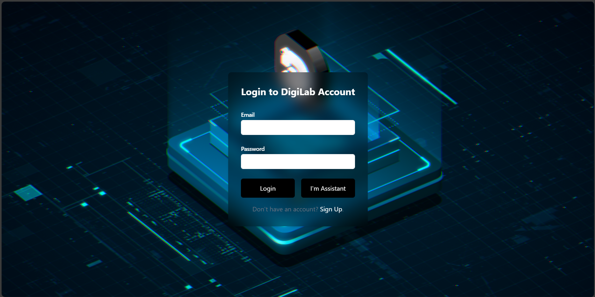


2. **Register page:** Halaman ini digunakan bagi pengguna yang ingin masuk ke WebDigilab dengan membuat akun baru.

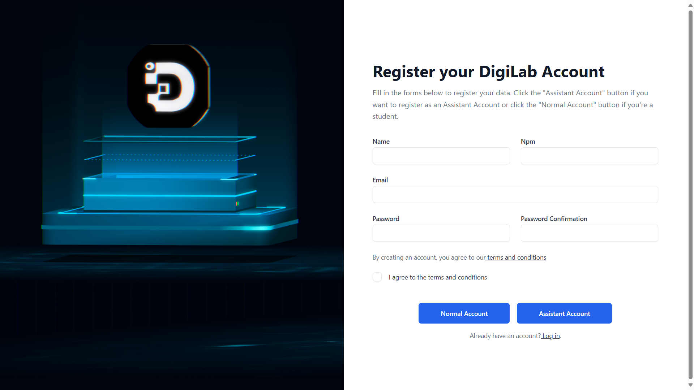

3. **Home page:** Halaman ini merupakan halaman beranda yang menyambut pengguna yang masuk. Pada halaman ini pengguna dapat pergi ke halaman Courses bagi Praktikan dan Edit Courses khusus bagi Asisten.

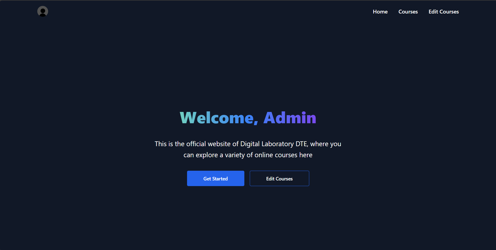

4. **Courses page:** Halaman ini merupakan halaman bagi pengguna untuk menelusuri berbagai course yang dapat diakses olehnya. Pengguna dapat memilih sebuah course untuk pergi ke halaman course tersebut.

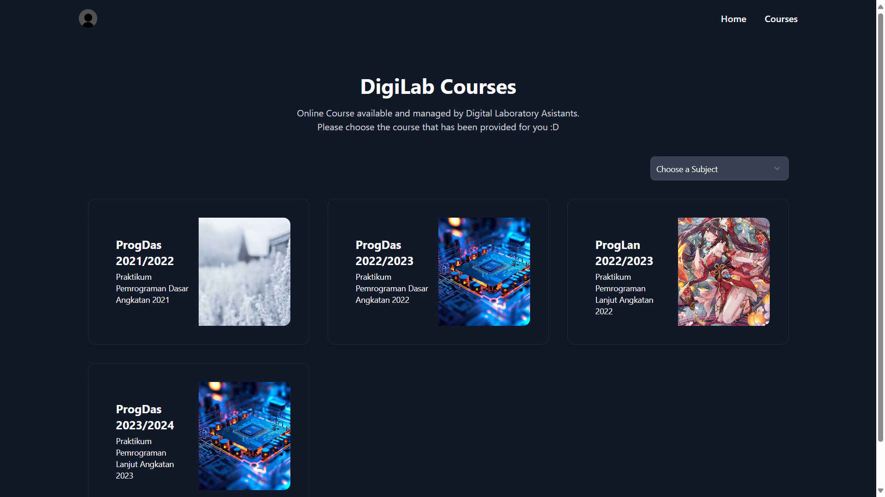

5. **Course page:** Halaman ini merupakan halaman bagi pengguna untuk membaca modul pada course yang telah dipilihnya.

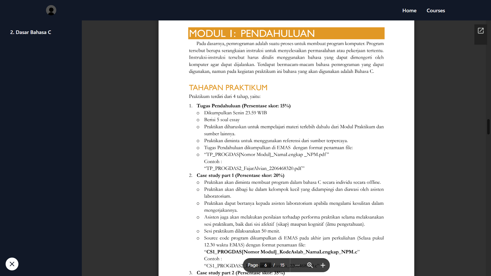

6. **Edit Courses page:** Halaman ini merupakan halaman bagi Asisten untuk mengedit course, menambahkan course, dan menambahkan chapter yang ada pada WebDigilab.

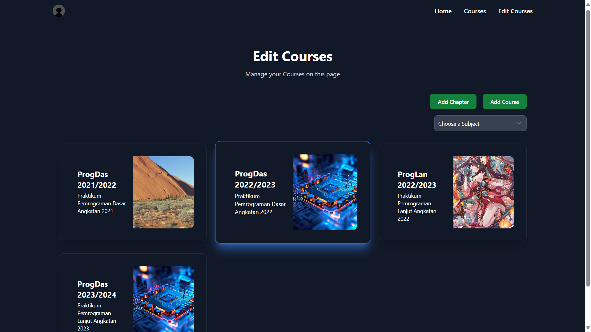

7. **Edit Course form:** Form ini digunakan oleh Asisten untuk mengedit course yang ada. 

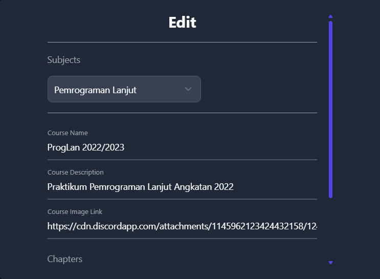

8. **Add Course form:** Form ini digunakan oleh Asisten untuk menambahkan sebuah course baru pada WebDigilab.

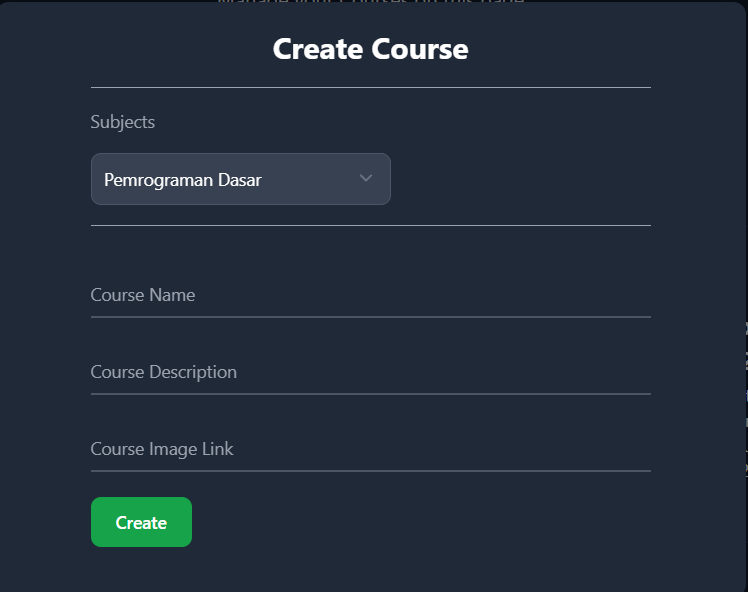

9.  **Add Chapter form:** Form ini digunakan oleh Asisten untuk menambahkan sebuah chapter baru pada WebDigilab.

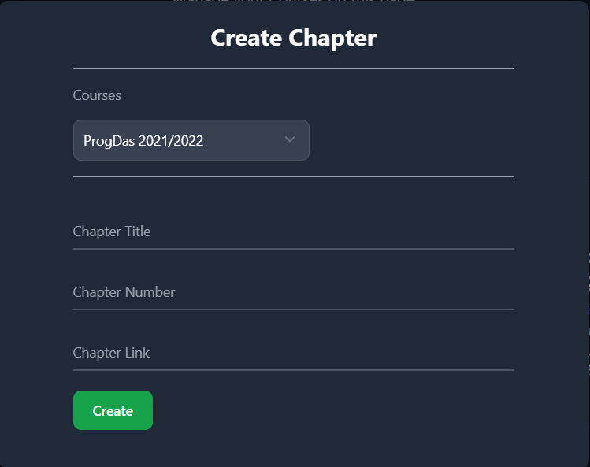

10. **Navigation:** Fitur ini berguna untuk memudahkan pengguna berpindah-pindah halaman dari Home, Courses, dan Edit Courses.

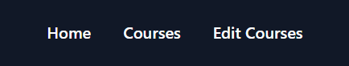

11. **Account Settings:** Halaman ini berguna untuk pengguna mengedit profile dari akunnya.

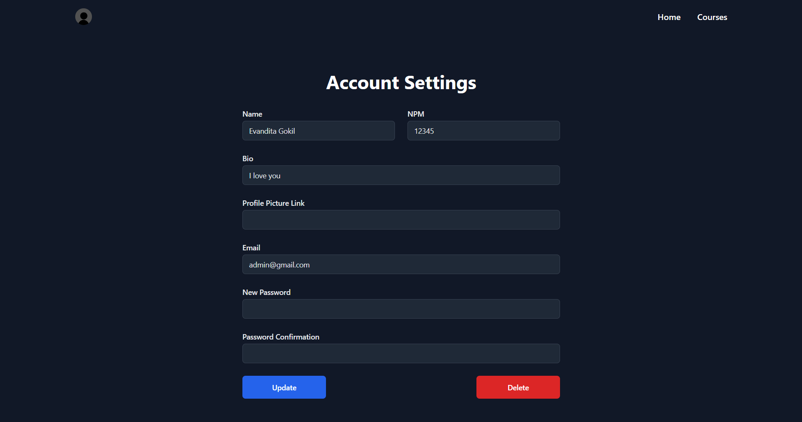

### Dockerizing
Kita dapat menjalankan Dockerfile Frontend, gunakan perintah `docker build -t frontend.` di direktori yang berisi Dockerfile. Ini akan membuat Docker image dengan nama `frontend`. Setelah Docker image dibuat, Kita dapat menjalankannya menggunakan perintah `docker run -p 3000:3000 frontend`.


## Back End
Back end adalah aplikasi web yang dibangun menggunakan NodeJS sebagai runtime environment. NodeJS memungkinkan pengembangan aplikasi web yang cepat dan efisien, dan dapat diintegrasikan dengan Frontend untuk menyediakan pengalaman pengguna yang lengkap.

Back End bertanggung jawab untuk menangani otentikasi pengguna, mengelola data pengguna, mengelola data proyek, mengelola data laporan, menangani permintaan pencarian, dan menangani kesalahan.


### Components
1. **Auth Component:**
Komponen Auth bertanggung jawab untuk menangani otentikasi pengguna. Ini menyediakan metode untuk login, logout, dan registrasi.

2. **User Component:**
Komponen User bertanggung jawab untuk menangani data pengguna. Ini menyediakan metode untuk membuat, memperbarui, dan menghapus pengguna.

3. **Project Component:**
Komponen Project bertanggung jawab untuk menangani data proyek. Ini menyediakan metode untuk membuat, memperbarui, dan menghapus proyek.

4. **Report Component:**
Komponen Report bertanggung jawab untuk menangani data laporan. Ini menyediakan metode untuk membuat, memperbarui, dan menghapus laporan.

5. **Search Component:**
Komponen Search bertanggung jawab untuk menangani permintaan pencarian. Ini menyediakan metode untuk mencari proyek dan laporan.

6. **Error Handling Component:**
Komponen Error Handling bertanggung jawab untuk menangani kesalahan. Ini menyediakan metode untuk menangani kesalahan dan mengirim respon kesalahan.

### Dockerizing
Kita dapat menjalankan Dockerfile Backend, gunakan perintah `docker build -t backend.` di direktori yang berisi Dockerfile. Ini akan membuat Docker image dengan nama `backend`. Setelah Docker image dibuat, Kita dapat menjalankannya menggunakan perintah `docker run -p 3600:3600 backend`.

## Report
[Link Report](https://github.com/Evandita/Docker)

## Presentation
[Link Presentasi](https://www.canva.com/design/DAGGjwpPZHc/S4d1XdodB1ODNVvyFUyj8Q/edit?utm_content=DAGGjwpPZHc&utm_campaign=designshare&utm_medium=link2&utm_source=sharebutton)


